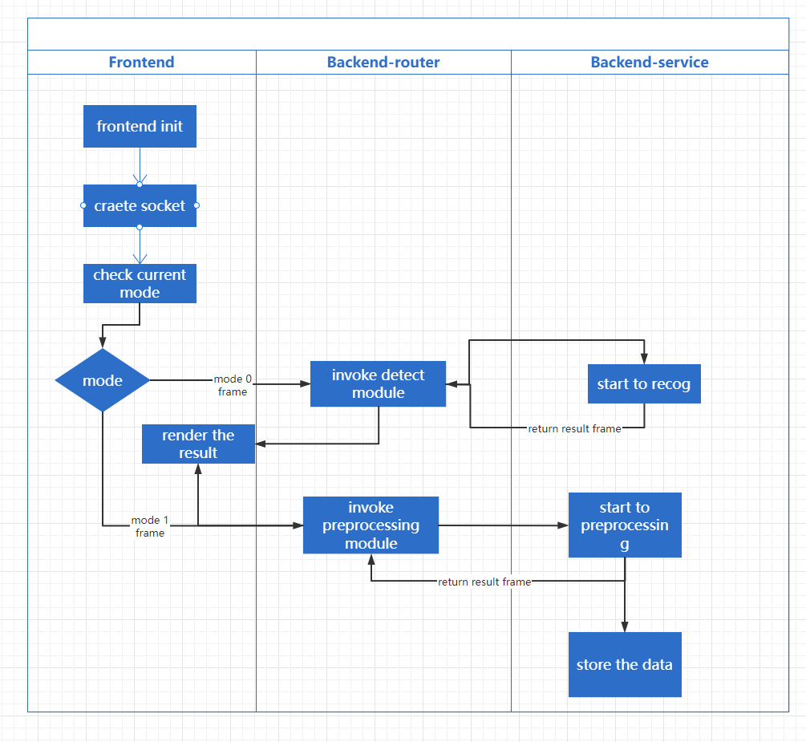

# Distributed system CA

## Introduction

In this report, we will introduce a real-time face recognition system based on Flask and SocketIO in detail. The main functions of this system are: real-time face detection, identification of registered users, and collection of sample data for new users. First, we'll cover the back-end code, then the front-end code and explain relevant implementation details.


## Architecture

In this project, I used the separation of the front and back ends, and used socketio for communication

The overall process and structure of the project are shown in the figure below. There will be two functions in the front end

1. face recognition

   - Face recognition will be used to identify the user and return the user's name in the existing data based on facial features

2. face preprocessing

   - In the face preprocessing, the user's facial features will be recorded and saved for subsequent face recognition comparison

   





## Technologies.

1. socket.io-client

   - `socket.io-client` is a JavaScript library for enabling real-time, bidirectional communication in browser or Node.js environments. It is the client-side counterpart of the Socket.IO library, which works together with the server-side Socket.IO library. Socket.IO is built on top of WebSockets but also provides fallbacks to other communication methods when WebSockets are not available or not supported, thus ensuring compatibility with various environments.

     The library simplifies the process of establishing a connection between a client and a server, managing reconnections, and emitting and listening for custom events. It's commonly used for developing real-time applications such as chat apps, online games, and live updates on web pages.

2. Reactjs

   - React is popular for its component-based architecture, which encourages modular and maintainable code. Components are self-contained, reusable pieces of code that can manage their own state and render UI elements. This approach simplifies the development of complex applications and promotes the reuse of code across different parts of an application.

3. Flask

   - Flask is a popular choice among Python developers for creating web applications, APIs, and web services, thanks to its simplicity, ease of use, and extensive ecosystem of extensions and libraries.

4. Flask-SocketIIO

   - Flask-SocketIO is an extension for the Flask web framework that enables real-time communication between a web server and clients using the WebSocket protocol. It is built on top of the Socket.IO library, which provides a high-level API for managing bi-directional communication between a server and multiple clients. This library simplifies the process of adding real-time functionality to Flask applications, such as chat applications, live updates, and notifications.

5. gevent

   - `gevent` is a Python library that provides a lightweight, concurrent, and cooperative multitasking framework using greenlets. Greenlets are small, independent, and cooperative units of execution that are scheduled and managed by the `gevent` library. The library is designed to make it easy to create and manage a large number of concurrent tasks while maintaining high performance and low overhead.

6. opencv

   - OpenCV (Open Source Computer Vision Library) is an open-source computer vision and machine learning software library. It was originally developed by Intel and later supported by Willow Garage and Itseez (which was acquired by Intel). OpenCV is written in C++ and has interfaces for Python, Java, and MATLAB/Octave, making it accessible to a wide range of developers.

7. Numpy

   - NumPy (Numerical Python) is a popular open-source library for numerical computing in Python. It provides a high-performance, multidimensional array object called ndarray, along with a variety of functions and tools for performing mathematical operations, linear algebra, random number generation, and other numerical tasks.


## Backend code

### Face Preprocessing Module

This part of the code initializes some variables, including image scaling, Haar cascade classifier path, image data directory, and lists for storing images, labels, names, and IDs.

```
size = 4
classifier = 'Haarcascades/haarcascade_frontalface_default.xml'
image_dir = 'service/images'
(images, labels, names, id) = ([], [], {}, 0)
```


In the preprocessing module, we used the OpenCV library for face detection. In a given picture, the program first converts the image to a grayscale image and then detects faces using a Haar cascade classifier. Detected faces will be cropped, resized and saved to a local folder. The main function of this module is preprocessing(frame, name).


```
haar_cascade = cv2.CascadeClassifier(classifier)
gray = cv2.cvtColor(frame, cv2.COLOR_BGR2GRAY)
mini = cv2.resize(gray, (int(gray.shape[1] / size), int(gray.shape[0] / size)))
faces = haar_cascade.detectMultiScale(mini)
```


After reading all the training data, convert the list of images and labels to NumPy arrays. Then create a LBPH (Local Binary Pattern Histogram) face recognizer and train it with the training data.

```
(images, labels) = [numpy.array(lis) for lis in [images, labels]]
model = cv2.face.LBPHFaceRecognizer_create()
model.train(images, labels)
```


### 2 .face recognition module

The fileNumber function takes a folder path as input and returns the number of files in the folder.

```
def fileNumber(path):
    count = len(os.listdir(path))
    return count
```


This code loads the Haar cascade classifier, converts the input frame to a grayscale image, and then downscales it for faster detection. Finally, a Haar cascade classifier is used to detect faces in the downscaled image.

```
haar_cascade = cv2.CascadeClassifier(classifier)
gray = cv2.cvtColor(frame, cv2.COLOR_BGR2GRAY)
mini = cv2.resize(gray, (int(gray.shape[1] / size), int(gray.shape[0] / size)))
faces = haar_cascade.detectMultiScale(mini)
```


The main function of the face recognition module is to recognize the faces of registered users. We used the LBPH algorithm (Local Binary Patterns Histograms) for face recognition. The main function of this module is faceRecog(frame).

Key code snippet:

```
model = cv2.face.LBPHFaceRecognizer_create()
model.train(images, labels)
prediction = model.predict(face_resize)
```


This code first checks to see if a face is detected. If a face is detected, extract the face area and save it in the specified folder. The saved file is named after the face name and the processed frame is returned.

```
if faces:
    face_i = faces[0]
    (x, y, w, h) = [v * size for v in face_i]
    ...
    with open(os.path.join(path, '{}.jpg'.format(imageNumber)), 'wb') as f:
        f.write(buffer.tobytes())
    return frame
```


This code is used to perform face preprocessing on a given video frame, including face detection, extraction, saving, etc. The saved face images can be used for subsequent face recognition model training.


### 3 Flask application communicates with SocketIO

In this part of the code, we use the Flask framework to build a simple web server and realize real-time communication through SocketIO. We define two SocketIO event handlers: processFace(data) and handle_video_frame(data). The former is used to handle pre-processing events, and the latter is used to handle real-time face recognition.

Key code snippet:

```
@socketio.on('preprocessing')
def processFace(data):
    ...
    resData = preprocessing(frame, name)
    emit('result_data', resData)

@socketio.on('video_frame')
def handle_video_frame(data):
    ...
    resData = faceRecog(frame)
    emit('resDetect', resData)
```


Define an auxiliary function buffer2frame, which is used to convert the received image data into OpenCV frame format.

```
def buffer2frame(data):
    compressed_image_data = np.frombuffer(data, dtype=np.uint8)
    frame = cv2.imdecode(compressed_image_data, cv2.IMREAD_COLOR)
    return frame
```


At the __main__ entry, use gevent's WSGIServer to start the application, listen to port 5000 of 0.0.0.0, and use WebSocketHandler to handle WebSocket requests.


## Modification

As mentioned in the requirements, after flask has obtained a large amount of image data, if a calculation is performed on each image, it will consume a very large cpu resource. Therefore, to solve the three problems mentioned in the requirements, I Made some modifications

1. ### Compress the frames/ Skip some frames

​	After the front end acquires the camera, use canvas to frame the video captured by the camera, (send once every 0.3) and compress the image quality to the original 0.8 to reduce the amount of data transmitted by words

In the same way, when the user is performing preprocessing, the data is also transmitted through the following method, but it is sent once per second

```
const canvas = document.createElement("canvas");
canvas.width = videoElement.videoWidth;
canvas.height = videoElement.videoHeight;
canvas.getContext("2d").drawImage(videoElement, 0, 0);

// 将canvas转换为Blob或ArrayBuffer
canvas.toBlob(
(blob) => {
// console.log(blob);
socket.emit("video_frame", blob);
},
"image/jpeg"
);
}, 300, 0.8);
```


### 


## Front-end code

### 1 Page Layout and Style

The front-end page implements simple page layout and styling using HTML and CSS. It mainly includes a video preview window, an input box for entering the user's name and a button for starting face collection.

### 2 JavaScript communicates with SocketIO

In the front-end JavaScript code, we use the SocketIO library to realize real-time communication with the back-end. When the user clicks the button, the program sends the video frames captured from the camera to the backend for processing. The backend returns the processed video frames to the frontend and displays them in the browser in real time.


```
socket.on('resDetect', function (data) {
    var image = new Image();
    image.src = 'data:image/jpeg;base64,' + arrayBufferToBase64(data);
    image.onload = function () {
        ctx.drawImage(image, 0, 0, canvas.width, canvas.height);
    };
});
```


In this code, we receive processed video frame data from backend and convert it to Base64 encoded image. Then, we display this image on an HTML canvas element.

### 3 Collect new user data

In the onloadedmetadata event of the video element, a frame of video is captured at regular intervals (300ms) and sent to the server. First create a temporary canvas element, then draw the video frame. Next, convert the canvas to a Blob object and send it to the server using socket.emit . Additionally, a handler is added for the socket disconnect event.

```
canvas.toBlob(
(blob) => {
// console.log(blob);
socket.emit("video_frame", blob);
},
"image/jpeg"
);
}, 300);
}
```


In order to collect data from new users, we need to provide an input box on the front end for users to enter their name. When the user clicks the "Start Capture" button, the program will capture the current video frame and send it along with the user's name to the backend for processing.

Defines a preprocessing function for sending frames for preprocessing. When the mode is 1, a frame of video is captured every certain time (1000ms) and sent to the server, along with the name of the input.

```
setInterval(() => {
if (!isVideoReady) return;
const canvas = document.createElement("canvas");
canvas.width = videoElement.videoWidth;
canvas.height = videoElement.videoHeight;
canvas.getContext("2d").drawImage(videoElement, 0, 0);

// 将canvas转换为Blob或ArrayBuffer
canvas.toBlob(
(blob) => {
// console.log(blob);
socket.emit("preprocessing", {"blob": blob, "name": inputValue});
},
"image/jpeg"
);
}, 1000);
```


Add handler for 'resDetect' event when socket or mode changes. When receiving the image buffer from the server, convert it to a Blob object and create a URL object. Then, use the drawImage function to draw the image onto the canvas.


```
  useEffect(() => {
    const drawImage = (imageUrl) => {
      const canvas = canvasRef.current;
      const context = canvas.getContext('2d');
      const image = new Image();
      image.src = imageUrl;

      image.onload = () => {
        context.drawImage(image, 0, 0, canvas.width, canvas.height);
      };
    };

    if (socket) {
      socket.on('resDetect', (imageArrayBuffer) => {
        console.log(imageArrayBuffer)
        const arrayBufferToBlob = (buffer, type) => {
          return new Blob([buffer], { type: type });
        };
        
        const imageBlob = arrayBufferToBlob(imageArrayBuffer, 'image/jpeg');
        const imageUrl = URL.createObjectURL(imageBlob);
        drawImage(imageUrl);
      });
  
      return () => {
        socket.disconnect();
      };
    }
  }, [socket, mode]);
```


In this code, we add a click event listener. When the user clicks the "Start Capture" button, the program will capture the current video frame and send it to the backend together with the user's name for preprocessing.

## Summarize

This real-time face recognition system uses Flask and SocketIO as the backend and HTML, CSS and JavaScript as the frontend. By using the OpenCV library for face detection and recognition, the system can recognize the faces of registered users in real time and collect sample data for new users.

The back-end code mainly includes three parts: face preprocessing module, face recognition module and Flask application communicating with SocketIO. The front-end code includes page layout and style, JavaScript and SocketIO communication, and collection of new user data.

This system can be used as a basic framework to implement more advanced functions, such as real-time face tracking, automatic check-in, etc. In the future, you can consider optimizing algorithm performance, improving recognition accuracy, and expanding the front-end interface and functions.